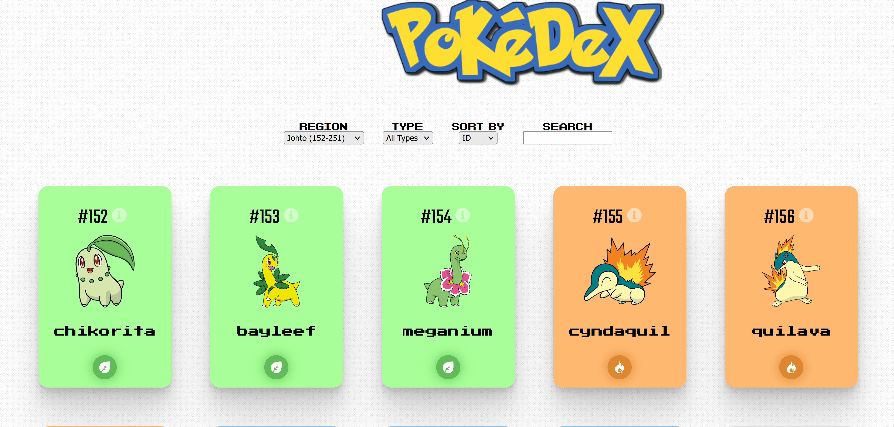

# PokeRtk = Pokedex + Redux-Toolkit

A simple PokemonCard catalogue frontend app, build with React, Redux-Toolkit, Material-UI. It uses backend powered by [PokeAPI](https://pokeapi.co/). 

It's a learning project following [pokedex](https://github.com/s1varam/pokedex). In this project, I practised following skills:
* Use React to create View for FE
* Use redux, react-redux, redux-toolkit (RTK) for state management
* Use storybook to design component
* Use [RTK Query](https://redux-toolkit.js.org/rtk-query/overview) for fetching

Feature of the pokedex application:

* Display list of pokemon cards
* Fetching pokemon cards by region

* Filter pokemon cards by type

* Sort pokemon cards by name or ID

* Filter pokemon cards by search naming

* Show pokemon card detail

Deployed on [Netlify](https://pokedex-rtk.netlify.app/)

Storybook builds on [Chromatic](https://www.chromatic.com/builds?appId=645cedbb11414edc1f2eb16c)

## Available Scripts

In the project directory, you can run:

* `nvm use`: use node version according to `.nvmrc`
* `yarn start`: run the development server
* `yarn storybook`: start storybook server to check component rendering
* `yarn build`: build the app for production

## TODO

* [x] Fix css of Filter component
* [x] Fix Poke logo size via css
* [ ] Add day/night toggle in header
* [x] Add github icon in header
* [ ] Use material.ui to display pokemon cards
* [x] Fix round corner of InfoDialog component
* [ ] Add error handling for data fetching across app
* [x] Deploy through netlify
